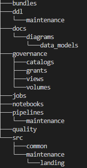

# Loadstar Analytics: Databricks Data Platform

## Overview

Loadstar Analytics is a data platform built on Databricks that models the operations of an end-dump trucking company.

The platform is designed to solve two core business problems:

1. Increase revenue per truck  
2. Minimize unplanned downtime  

It demonstrates how to design, build, and scale a modern data platform using:

- Medallion architecture
- Structured Streaming & batch processing
- Dimensional modeling
- Unity Catalog governance
- Data quality and monitoring
- AI-powered analytics agents

---

## Business Context

Loadstar Trucking transports bulk materials between job sites, quarries, and landfills.

Revenue is generated through:
- per load
- per mile
- contract-based pricing

Costs include:
- fuel
- labor
- maintenance
- downtime

### Core Objectives

- Increase revenue per truck  
- Reduce operational costs  
- Minimize downtime  
- Improve dispatch efficiency  
- Ensure accurate billing  

---

## Architecture

### High-Level Design

### Data Layers

#### Bronze (Raw)
- JSON event ingestion
- Stored in Unity Catalog Volumes
- Immutable, replayable data

#### Silver (Cleaned)
- Schema enforcement
- Deduplication
- Normalized structures
- Entity extraction

#### Gold (Business Models)
- Fact and dimension tables
- KPI-ready datasets
- Optimized for analytics

---

## Data Modeling

The platform uses a dimensional model aligned to business KPIs.

### Key Design Principles

- Surrogate keys for all dimensions
- Business keys preserved for traceability
- Fact tables defined at strict grains
- Conformed dimensions across domains

---

### Core Fact Tables

#### Revenue Domain

- `fact_trip:` trip-level revenue and cost  
- `fact_truck_day:` daily truck performance (aggregated)  
- `fact_job:` job-level profitability  

#### Maintenance Domain

- `fact_truck_downtime:` downtime tracking  
- `fact_failure_event:` failure events  
- `fact_repair_event:` repair operations  

---

### Example KPIs

- Revenue per truck per day  
- Margin per job  
- Cost per mile  
- Mean Time Between Failures (MTBF)  
- Mean Time To Repair (MTTR)  
- Unplanned downtime hours  

Derived metrics:
- Revenue per load capacity  
- Cost per mile  
- Margin percentages  

---

## Project Structure

---

## Data Generation (Simulation Layer)

The platform includes a realistic event simulation layer for maintenance data.

### Design

- `reference_data.py:` small, controlled entity pools (trucks, sites, vendors)
- `event_builders.py:` event construction logic
- `generate_truck_maintenance_events.py:` orchestration + ingestion

### Why this matters

- Simulates real-world event ingestion
- Supports streaming patterns without external dependencies
- Enables full pipeline testing end-to-end

---

## Streaming vs Batch

### Revenue
- Batch-oriented
- Daily aggregation acceptable

### Downtime
- Event-driven
- Near real-time processing
- Structured Streaming ready

---

## Governance

Implemented using Unity Catalog:

- Catalog: `loadstar`
- Domain schemas:
  - maintenance_raw / bronze / silver / gold
  - transport_raw / bronze / silver / gold
- Role-based access control (RBAC)
- Data lineage and audit readiness

---

## AI Layer 

The platform is designed to support AI agents:

### Ops Analyst Agent
- Detects anomalies in downtime
- Identifies repeat failures
- Suggests root-cause analysis

### Executive KPI Agent
- Generates summaries of revenue and margin
- Answers business questions via SQL

### Data Steward Agent
- Maintains documentation
- Validates schema consistency
- Detects modeling issues

---

## Why This Project

This project demonstrates:

- Real-world data platform design
- Business-first modeling
- Strong understanding of Databricks
- Ability to connect engineering to business outcomes

---

## Future Enhancements

- Real-time ingestion via Kafka/Event Hubs
- Advanced anomaly detection
- AI-driven root cause analysis
- Cost monitoring and optimization
- Expanded domains (fleet optimization, fuel analytics)

---

## Author

Kymane Llewellyn: Data & AI Consultant
